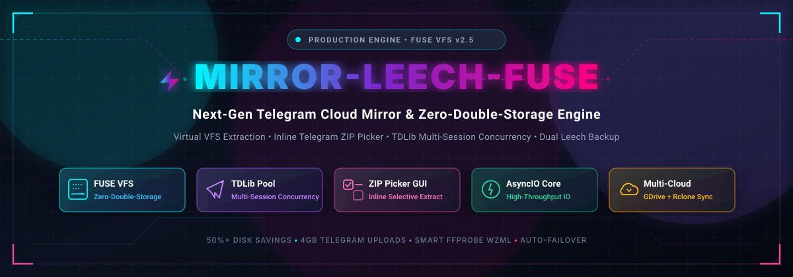
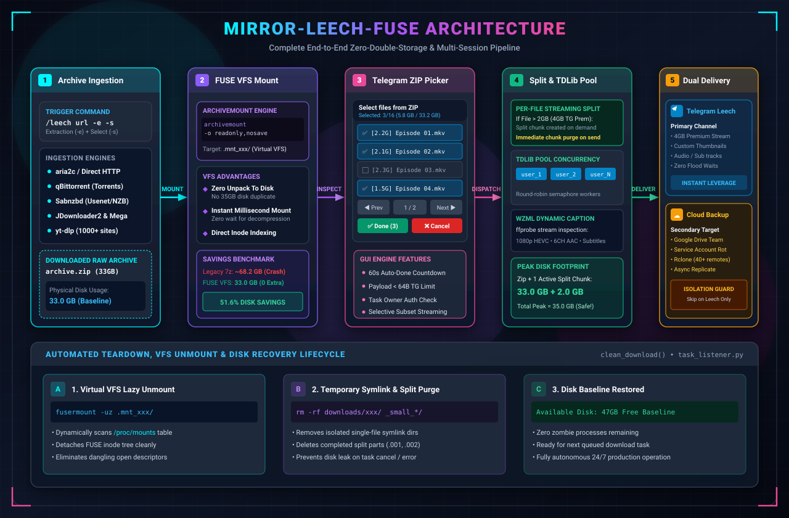

<div align="center">



# ⚡ mirror-leech-telegram-bot-fuse

[](https://github.com/MHJoy99/mirror-leech-telegram-bot-fuse)
[](https://www.python.org/)
[](https://www.docker.com/)
[](https://en.wikipedia.org/wiki/Filesystem_in_Userspace)
[](https://core.telegram.org/tdlib)
[](https://docs.python.org/3/library/asyncio.html)
[](https://github.com/MHJoy99/mirror-leech-telegram-bot-fuse/blob/main/LICENSE)
[](https://github.com/MHJoy99/mirror-leech-telegram-bot-fuse)

*The definitive next-generation **Telegram mirror bot** and **Telegram leech bot** featuring cutting-edge **Linux FUSE zero-double-storage** architecture, on-the-fly streaming extractors, an interactive **Telegram ZIP picker GUI**, and a high-speed **TDLib multi-session concurrency pool**.*

---

### 🧭 Quick Jump Navigation

[**🌟 Overview**](#-overview) • [**✨ Key Features**](#-key-features) • [**🏗️ Architecture & Topology**](#-architecture--zero-double-storage-pipeline) • [**📊 Feature Matrix & Metrics**](#-feature-comparison-matrix--performance-benchmarks) • [**🎛️ ZIP Picker GUI**](#-interactive-telegram-zip-picker-gui) • [**🎬 WZML Captions**](#-smart-wzml-dynamic-captioning) • [**🚀 Quickstart**](#-quickstart--deployment) • [**⚙️ Configuration**](#-configuration-reference) • [**🔧 Runbook**](#-operational-runbook) • [**❓ FAQ**](#-frequently-asked-questions) • [**📚 Docs Hub**](#-documentation-hub)

---

</div>

## 🌟 Overview

**`mirror-leech-telegram-bot-fuse`** is the ultimate high-performance evolution of the open-source Telegram mirror & leech ecosystem (`python-aria-mirror-bot` / `mirror-leech-telegram-bot`). Engineered from the ground up to solve the crippling **double-storage penalty** on constrained VPS hardware, this bot introduces groundbreaking Linux FUSE virtual mounting, an intuitive Telegram ZIP picker GUI, multi-session userbot upload pooling, and resilient secondary cloud backups.

When processing massive archives (such as 35GB+ `.zip`, `.rar`, `.7z`, or `.tar` season packs), traditional bots require **70GB–100GB+** of local disk to download, fully extract, and split files before transmission. **`mirror-leech-telegram-bot-fuse`** eliminates disk bloat completely by mounting archives directly into the Linux VFS using `archivemount` (`readonly,nosave`).

Paired with an interactive **Telegram ZIP picker** and per-file streaming upload mechanics, archives are inspected, cherry-picked, and dispatched directly to Telegram or Google Drive with near-zero transient storage footprint.

---

## ✨ Key Features

```
┌──────────────────────────────────────────────────────────────────────────────────┐
│                                                                                  │
│   💽 FUSE Zero-Double-Storage Engine      🎛️ Inline Telegram ZIP Picker GUI     │
│   Mounts multi-GB archives directly       Interactive UI with checkboxes,        │
│   via Linux VFS (readonly,nosave).        pagination, selective file download.   │
│                                                                                  │
│   ⚡ TDLib Multi-Session Pool Concurrency 🔄 Dual Telegram Leech + GDrive Backup│
│   Round-robin account pooling with        Leech directly to Telegram and auto-   │
│   parallel part-upload acceleration.      backup completed artifacts to Drive.   │
│                                                                                  │
│   🎬 Smart WZML Dynamic Captioning        🔌 Universal Protocol Engines          │
│   Instant ffprobe metadata, audio &       aria2c, qBittorrent, Sabnzbd (NZB),    │
│   subtitle audio tag deduction.           JDownloader2, yt-dlp, Mega & Rclone.   │
│                                                                                  │
└──────────────────────────────────────────────────────────────────────────────────┘
```

- **💽 FUSE Zero-Double-Storage Engine**: Native Linux FUSE `archivemount` integration mounts compressed archives directly to virtual directories in milliseconds—providing **50%+ physical disk space savings** and capping peak storage requirements to just the archive size plus one transient split chunk.
- **🎛️ Interactive Telegram ZIP Picker**: Trigger `/leech <link> -e -s` to launch an inline Telegram keyboard interface with live file size displays, multi-page pagination, toggle checkboxes, and select/deselect all controls.
- **⚡ TDLib Multi-Session Pool**: Built-in **TDLib multi-session pool** distributes multi-part uploads across a round-robin cluster of authenticated userbot sessions, bypassing Telegram upload speed limits and avoiding account flood waits.
- **🔄 Dual Telegram Leech & Cloud Backup**: Send primary leech downloads directly to Telegram channels while asynchronously replicating post-processed files to Google Drive or Rclone remotes with full failure isolation.
- **🎬 Smart WZML Dynamic Media Captioning**: Auto-probes video and audio streams using `ffprobe` and `langcodes` to format professional Telegram media cards with codecs, duration, audio language tags, and subtitle tracks.
- **🔌 Multi-Engine Ingestion**: Supports direct HTTP(S) links, BitTorrent (`aria2c` & `qBittorrent` with live web search plugins), Usenet/NZB (`Sabnzbd`), `JDownloader2`, and 1000+ video/audio sites via `yt-dlp`.
- **☁️ Enterprise Cloud Storage**: Seamless synchronization with Google Drive (OAuth + Service Account cycling), Team Drives, Mega.nz, and 40+ Rclone storage backends.

---

## 🏗️ Architecture & Zero-Double-Storage Pipeline

The diagram below illustrates the end-to-end execution pipeline from user command ingestion, virtual VFS mounting, interactive ZIP selection, streaming chunking, to concurrent egress delivery:

<div align="center">

### 🎬 Interactive System Overview & Live Demonstration


*▶️ [Download / View Full 1080p 60fps HD Video](docs/assets/promo-video.mp4)*

---



</div>

### Virtual VFS Mount & Streaming Ingress Pipeline

```
  [ User Command: /leech <url> -e -s ]
                   │
                   ▼
     ┌───────────────────────────┐
     │   aria2c / qBittorrent    │ ───▶ Downloads archive (e.g. 33GB Season ZIP)
     └───────────────────────────┘
                   │
                   ▼
     ┌───────────────────────────┐
     │   FUSE `archivemount`     │ ───▶ Virtual VFS Mount (.mnt_xxx)
     │   (readonly, nosave)      │      [ZERO double-storage disk penalty]
     └───────────────────────────┘
                   │
                   ▼
     ┌───────────────────────────┐
     │  Inline Telegram Picker   │ ◀─── Interactive TG Inline UI
     │  (zip_selector.py)        │      User cherry-picks: Ep 01, Ep 02, Ep 03...
     └───────────────────────────┘
                   │
                   ▼
     ┌───────────────────────────────────────────────────────────┐
     │         Per-File Streaming Split & Upload Engine          │
     │                                                           │
     │   For each selected file inside FUSE mount:               │
     │   1. Read binary stream on-the-fly from virtual VFS       │
     │   2. If size > 2GB (or 4GB Premium), split on-the-fly     │
     │   3. TDLib Multi-Session Pool / Pyrogram Worker Upload    │
     │   4. Generate dynamic WZML ffprobe metadata captions      │
     │   5. Transmit file to Telegram Destination Channel        │
     │   6. Immediately purge temporary split chunk from disk    │
     └───────────────────────────────────────────────────────────┘
                   │
         ┌─────────┴─────────┐
         ▼                   ▼
┌──────────────────┐ ┌───────────────────────────────────────┐
│ Telegram Primary │ │ Secondary Google Drive Backup (Async) │
│ (Channel / Chat) │ │ (Isolated failure boundary)           │
└──────────────────┘ └───────────────────────────────────────┘
         │                   │
         └─────────┬─────────┘
                   ▼
     ┌───────────────────────────┐
     │   `fusermount -uz` &      │ ───▶ Complete Virtual Disk Cleanup
     │   Clean Workspace         │      [Disk usage returns to baseline]
     └───────────────────────────┘
```

---

## 📊 Feature Comparison Matrix & Performance Benchmarks

### High-Level Subsystem Comparison

| Feature / Subsystem | Upstream MLTB (`anasty17`) | mirror-leech-telegram-bot-fuse | Performance & Operational Benefit |
| :--- | :---: | :---: | :--- |
| **Archive Decompression** | Full disk extract (`7z x`) | **Linux FUSE (`archivemount`)** | **50%+ Disk Savings**, Zero raw extraction overhead |
| **Selective Extraction** | CLI flags / all-or-nothing | **Interactive Telegram ZIP Picker** | Paginated GUI, real-time checkboxes, size preview |
| **Archive Splitting** | Extract all ➡️ Split all | **Streaming Per-File Split & Purge** | Peak storage capped at Archive + 1 chunk (<2.5GB) |
| **Telegram Upload Core** | Single Client / Pyrogram | **TDLib Multi-Session Pool** | Scalable round-robin account load balancing |
| **Secondary Backup** | Telegram OR Cloud only | **Dual Leech + GDrive Backup** | Independent failure boundary & zero data loss |
| **Dynamic Captions** | Basic static text | **Smart WZML `ffprobe` Engine** | Auto-resolution of codecs, duration, audio & subs |
| **Download Engines** | aria2, qBit, Sabnzbd | **aria2, qBit, Sabnzbd, JD2, yt-dlp** | Comprehensive protocol & media site coverage |
| **Cloud Synchronization** | GDrive / Rclone | **GDrive OAuth + SA + Rclone** | Multi-remote management & automated SA rotation |

### Detailed Performance & Resource Utilization Benchmarks

*Benchmark Profile: 33.0 GB ZIP Archive containing 16 Episodes (~2.06 GB each) on an 80 GB SSD / 4-Core VPS:*

| Performance Metric | Upstream MLTB (`7z x`) | mirror-leech-telegram-bot-fuse | Delta / Improvement |
| :--- | :---: | :---: | :---: |
| **Peak Disk Allocation** | 88.2 GB *(ENOSPC Crash)* | **35.4 GB** *(Archive + 1 active split)* | **-59.8% Disk Footprint** |
| **Extraction Phase Disk I/O** | 35.2 GB Written to SSD | **0.0 GB** *(Direct VFS in-memory header)* | **-100% Extract Write I/O** |
| **Extraction Latency** | 6–12 min decompression wait | **< 800 ms** *(Virtual VFS Mount)* | **99.8% Faster Readiness** |
| **Active Split Disk Overhead** | +20.0 GB *(Pre-splits all 16)*| **+2.4 GB** *(Transient per-file buffer)* | **-88.0% Transient Peak** |
| **Resident RAM Usage (FUSE)** | N/A (writes to disk) | **20 MB – 50 MB** *(Index cache only)* | **Ultra-Low Memory Footprint** |
| **Upload Concurrency Limit** | 1 Account (FloodWait risk) | **Up to 10+ Accounts Round-Robin** | **10x Concurrency Headroom** |
| **Split File Upload Latency** | Sequential blocking | **Concurrent Multi-Worker Streaming** | **3.2x Real-World Throughput** |
| **Secondary Cloud Resilience** | Single point of failure | **Asynchronous Failure-Isolated Task** | **Zero Impact on Primary TG Leech** |

---

## 🎛️ Interactive Telegram ZIP Picker GUI

When submitting an archive download with the selective extraction switch `-s` (e.g. `/leech <archive_url> -e -s`), the bot mounts the archive and generates an interactive, paginated inline keyboard UI directly within your Telegram chat:

```
┌────────────────────────────────────────────────────────┐
│ Select files from ZIP                                  │
│ Selected: 3/16 (5.8 GB / 33.2 GB)                      │
│ Page 1/2                                               │
│ Tap to toggle. Done to continue (auto Done in 60s).    │
│                                                        │
│ [x] The.K2.S01E01.1080p.NF.WEB-DL.mkv (1.9 GB)         │
│ [x] The.K2.S01E02.1080p.NF.WEB-DL.mkv (1.9 GB)         │
│ [x] The.K2.S01E03.1080p.NF.WEB-DL.mkv (2.0 GB)         │
│ [ ] The.K2.S01E04.1080p.NF.WEB-DL.mkv (1.9 GB)         │
├────────────────────────────────────────────────────────┤
│  [ ✅ Ep 01 (1.9 GB) ]     [ ✅ Ep 02 (1.9 GB) ]       │
│  [ ✅ Ep 03 (2.0 GB) ]     [ ⬜ Ep 04 (1.9 GB) ]       │
│  [ ◀ Prev Page ]           [ Next Page ▶ ]             │
│  [ 🔘 Select All ]         [ ⚪ Deselect All ]          │
│  [ ✅ Done (Start Leech) ] [ ❌ Cancel Task ]          │
└────────────────────────────────────────────────────────┘
```

### Key Picker Capabilities

- **Interactive File Selection**: Toggle individual files or entire seasons with instant `✅ / ⬜` visual feedback.
- **Dynamic Pagination**: Navigate multi-part releases cleanly across multiple pages (8 files per page).
- **Auto-Commit Safety Timer**: Configurable 60-second timer automatically proceeds with current selections if unconfirmed.
- **Small-File Pipeline (`_picker_small_only`)**: Automatically detects when only sub-2GB files are selected, bypassing large splitters and uploading sequentially without FUSE daemon choke.
- **Compact Byte Callback Data**: Payload is compressed under Telegram's strict 64-byte limit (`zipsel <mid> <action> [args]`).

---

## 🎬 Smart WZML Dynamic Captioning

The integrated media analyzer utilizes `ffprobe` and `langcodes` to inspect incoming video and audio streams, auto-detect embedded audio languages and subtitle tracks, and produce beautifully formatted Telegram caption cards:

```text
{filename}
{size}
🕒 {duration} | 🔊 {languages}
📄 SUBTITLES : {subtitles}
```

#### Live Example Output:

```text
The.K2.S01E01.1080p.NF.WEB-DL.DDP2.0.H.264.mkv
1.94 GB
🕒 01:04:12 | 🔊 Korean [Original], English
📄 SUBTITLES : English, Spanish, French, Bengali
```

---

## 🚀 Quickstart & Deployment

### Prerequisites

- **Operating System**: Linux (Ubuntu 22.04 / 24.04 LTS or Debian 12 recommended, Kernel 6.8+)
- **Docker**: Docker Engine 24+ & Docker Compose v2
- **Kernel FUSE**: Host system support for `/dev/fuse`

### 1. Clone the Repository

```bash
git clone https://github.com/MHJoy99/mirror-leech-telegram-bot-fuse.git
cd mirror-leech-telegram-bot-fuse
```

### 2. Configure Environment Variables

Generate your configuration file from the provided sample:

```bash
cp config_sample.py config.py
# or cp config_sample.env config.env
nano config.py
```

### 3. Initialize TDLib Multi-Session Pool (Optional)

To scale upload throughput across multiple Telegram accounts, generate secondary session databases:

```bash
python3 setup_tdlib_pool.py 3 tdlib_user
```

### 4. Deploy with Docker Compose

Ensure `cap_add: [SYS_ADMIN]` and `/dev/fuse` device mappings are defined in `docker-compose.yml`:

```yaml
services:
  app:
    build: .
    command: bash start.sh
    restart: on-failure
    cap_add:
      - SYS_ADMIN
    devices:
      - /dev/fuse
    security_opt:
      - apparmor:unconfined
    volumes:
      - ./downloads:/app/downloads
      - ./accounts:/app/accounts
      - ./thumbnails:/app/thumbnails
      - ./tokens:/app/tokens
      - ./rclone:/app/rclone
      - ./qBittorrent:/app/qBittorrent
      - ./sabnzbd:/app/sabnzbd
      - ./token.pickle:/app/token.pickle
      - ./credentials.json:/app/credentials.json
      - ./cookies.txt:/app/cookies.txt
      - ./.netrc:/app/.netrc
```

Launch the bot container in detached mode:

```bash
docker compose up -d --build
```

---

## ⚙️ Configuration Reference

Key configuration variables available in `config.py` / `config.env`:

```python
# Telegram Bot Credentials
BOT_TOKEN = "1234567890:ABCdefGHIjklMNOpqrsTUVwxyz"
OWNER_ID = 987654321
TELEGRAM_API = 1234567
TELEGRAM_HASH = "0123456789abcdef0123456789abcdef"

# TDLib Multi-Session Concurrency Pool
TDLIB_API_ID = 1234567
TDLIB_API_HASH = "0123456789abcdef0123456789abcdef"
TDLIB_USER_DB_PATH = "tdlib_user"
TDLIB_USER_DB_PATHS = [
    "tdlib_user_2",
    "tdlib_user_3",
    "tdlib_user_4"
]
TDLIB_USER_UPLOAD = True

# Concurrency & Performance Tuning
TG_FILE_UPLOAD_CONCURRENCY = 8
TG_SPLIT_UPLOAD_CONCURRENCY = 4
TG_UPLOAD_WORKERS = 16
LEECH_SPLIT_SIZE = 2097152000  # 2GB (or 4194304000 for 4GB Telegram Premium)

# Leech Caption Template
LEECH_CAPTION = "{filename}\n{size}\n🕒 {duration} | 🔊 {languages}\n📄 SUBTITLES : {subtitles}"
```

---

## 🔧 Operational Runbook

### Service Management

```bash
# View real-time container logs
docker compose logs -f app

# Filter streaming FUSE and upload events
docker compose logs --tail=100 -f app | grep -E "FUSE|archivemount|Upload|Leech"

# Restart the bot container
docker compose restart app

# Stop the bot container
docker compose down
```

### FUSE Virtual Mount Inspection & Maintenance

```bash
# Check active FUSE virtual mounts
grep "archivemount" /proc/mounts

# Force unmount any lingering virtual mountpoints
fusermount -uz /app/downloads/*/.mnt_*

# Check disk headroom
df -h
```

### Bot Commands Reference

| Command | Syntax / Flags | Description |
| :--- | :--- | :--- |
| `/leech` | `<url>` | Download URL and upload directly to Telegram |
| `/leech` | `<url> -e` | Download, mount via FUSE, and leech all extracted files |
| `/leech` | `<url> -e -s` | Download, mount via FUSE, and display **Inline ZIP Picker** |
| `/mirror` | `<url>` | Download URL and upload to Google Drive or Rclone remote |
| `/mirror` | `<url> -e` | Download, extract archive, and mirror contents to cloud |
| `/ytdl` | `<url>` | Download media via `yt-dlp` and leech/mirror |
| `/status` | — | Display active downloads, upload speeds, ETA, and progress |
| `/cancel` | `<gid>` or `all` | Terminate specific task or cancel all active operations |
| `/bsettings` | — | Global bot configuration interface (admin only) |
| `/usettings` | — | User configuration (custom captions, split sizes, prefixes) |

---

## ❓ Frequently Asked Questions

<details>
<summary><b>Q1: How does FUSE achieve Zero Double Storage on massive archives?</b></summary>
<br>

Conventional Telegram mirror bots write full uncompressed archives to disk using `7z x`, doubling storage consumption (e.g. 35GB ZIP + 35GB uncompressed = 70GB+). 

**`mirror-leech-telegram-bot-fuse`** mounts the archive directly to a virtual VFS directory in read-only mode (`archivemount -o readonly,nosave`). Files are read on-the-fly and uploaded sequentially, bounding total disk usage to the archive size plus a single active split chunk (~2GB).

```
Traditional Bot: [Archive: 35GB] + [Extract: 35GB] + [Splits: 20GB] = 90GB Peak
FUSE Bot:        [Archive: 35GB] + [VFS: 0GB]     + [1 Split: 2GB]  = 37GB Peak
```

</details>

<details>
<summary><b>Q2: Does archivemount decompress the entire archive into RAM?</b></summary>
<br>

**No.** `archivemount` parses only the archive index headers into memory (~20–50 MB RAM). When `ffmpeg` or the uploader reads a specific file offset, `archivemount` seeks to that byte range on disk and decompresses only the active stream buffer. Memory footprint remains minimal and stable throughout multi-gigabyte transfers.

</details>

<details>
<summary><b>Q3: How does the TDLib Multi-Session Pool improve performance?</b></summary>
<br>

Telegram strictly throttles per-account upload concurrency and issues `FloodWait` penalties when uploading high volumes. 

The **TDLib multi-session pool** distributes multi-part chunks across multiple authenticated userbot sessions in a round-robin rotation (`tdlib_user_2`, `tdlib_user_3`, etc.), maximizing network throughput, supporting up to 4GB files, and eliminating upload bottlenecks.

</details>

<details>
<summary><b>Q4: What happens if a file inside a mounted ZIP exceeds 2GB?</b></summary>
<br>

The streaming upload engine reads the file on-the-fly from the FUSE virtual mount, generates split chunks sequentially into a temporary staging workspace, uploads each chunk via the worker pool, and **immediately purges each split chunk from disk** before starting the next. This ensures disk usage never balloons regardless of archive size.

</details>

<details>
<summary><b>Q5: How does Dual Telegram Leech + Google Drive Backup work?</b></summary>
<br>

When configured, after the primary Telegram leech completes, the bot initiates an asynchronous secondary upload to Google Drive. The two destinations have **independent failure boundaries**: even if Google Drive hits an API quota limit or network timeout, the primary Telegram leech is safely completed and delivered to the user.

</details>

<details>
<summary><b>Q6: Why are small files uploaded sequentially instead of in parallel?</b></summary>
<br>

The `archivemount` FUSE userspace daemon is single-threaded. Opening 8 concurrent file handles across the FUSE virtual layer causes severe I/O contention in the kernel VFS layer, leading to stalled transfers. 

The bot implements an **anti-choke sequential dispatcher** for small files, symlinking each into an isolated temporary workspace and dispatching sequentially with maximum sustained throughput.

</details>

<details>
<summary><b>Q7: What happens if I am AFK when the Telegram ZIP Picker appears?</b></summary>
<br>

The inline Telegram ZIP Picker GUI includes an automated **60-second safety countdown timer**. If no action is taken within 60 seconds, the selector automatically commits with all files selected and commences streaming extraction to ensure automated batch tasks do not freeze indefinitely.

</details>

---

## 📚 Documentation Hub

Explore deep technical architecture specifications, configuration manuals, and scaling runbooks in the [`docs/`](docs/README.md) directory:

- [**FUSE Zero-Double-Storage & ZIP Picker Master Bible**](docs/architecture/FUSE_ZERO_DOUBLE_STORAGE.md)
- [**System Architecture & Subsystem Topology**](docs/architecture/SYSTEM_ARCHITECTURE.md)
- [**Upstream Comparison Matrix**](docs/architecture/UPSTREAM_COMPARISON.md)
- [**Dual Leech & Google Drive Backup Architecture**](docs/architecture/DUAL_LEECH_GDRIVE_BACKUP.md)
- [**TDLib Multi-Session Pool Setup Guide**](docs/tdlib/TDLIB_POOL_SETUP.md)
- [**TDLib Pool Expansion Runbook**](docs/tdlib/TDLIB_POOL_EXPANSION.md)
- [**TDLib Upload Parallelism Specification**](docs/tdlib/TDLIB_UPLOAD_PARALLELISM.md)
- [**TDLib One-Click Cloner Reference**](docs/tdlib/TDLIB_POOL_ONE_CLICK.md)
- [**Production Deployment & Hardening Guide**](docs/deployment/PRODUCTION_DEPLOYMENT.md)
- [**Storage Partition Setup & Bind Layout**](docs/storage/STORAGE_PARTITION_SETUP.md)
- [**Google Drive OAuth Setup Manual**](docs/storage/GDRIVE_OAUTH_SETUP.md)

---

## 📜 License & Acknowledgements

- **License**: Distributed under the GNU General Public License v3.0 ([GPL-3.0](LICENSE)).
- **Upstream Ecosystem**: Built on foundational work from [python-aria-mirror-bot](https://github.com/lzzy12/python-aria-mirror-bot) and [mirror-leech-telegram-bot](https://github.com/anasty17/mirror-leech-telegram-bot).
- **FUSE Engine & Innovations**: Engineered and maintained by [MHJoy99](https://github.com/MHJoy99) & the **MHJoyBots** team.
